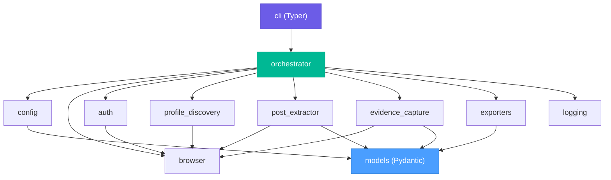

# Projeto Luanny — Plano de Implementação Prática

## Status Geral do Projeto

| Fase | Status | Validação |
|---|---|---|
| **Fase 0** — Fundação e Contratos | ✅ Completa | 21/21 testes passando, CLI funcional, pipeline stub operacional |
| **Fase 1** — Browser e Autenticação | ✅ Concluída | Autenticação persistida, sessão funcional |
| **Fase 2** — Descoberta de Postagens | ✅ Concluída | Descobre grid dinâmico via scroll virtual |
| **Fase 3** — Extração de Dados do Post | ✅ Concluída | Pega métricas HTML, Acessibilidade e Analisa ARIA |
| **Fase 4** — Evidência e Exportação | ✅ Concluída | Salva HTML bruto, Screenshots lidados isolavelmente e conversores JSON/MD/CSV |
| **Fase 5** — Robustez e Observabilidade | ✅ Concluída | Falhas de rede via Tenacity, Limits de Ação e Evidências Adicionais em Crash |
| **Fase 6** — Distribuição Windows, E2E, Docs | ✅ Concluída | Standalone compativel gerado com sucesso |
| **Fase 7** — Módulo de Áudio | 🚫 Fora da v1 | — |

## Roteiro de Execução por Prioridade

### Prioridade 1 — Estabilizar o executável

Objetivo: garantir que o build do Windows seja reproduzível e que o pacote final inclua o que precisa ser incluído, sem carregar lixo de ambiente ou bloquear o que deve ser versionado.

1. Corrigir o `.gitignore` para manter `Luanny.spec` versionado e excluir apenas artefatos realmente gerados localmente.
2. Revisar o script de build e o `.spec` para garantir que o empacotamento não dependa do diretório atual nem de arquivos temporários.
3. Validar o executável em um ambiente limpo, com foco em inicialização, carregamento de dependências e geração de saída.

### Prioridade 2 — Tornar caminhos e runtime previsíveis

Objetivo: eliminar dependência implícita do diretório corrente para `storage_state`, logs e saídas.

1. Tornar os caminhos de sessão, logs e exportação explícitos e resilientes em modo frozen.
2. Confirmar que o coletor encontra seus recursos tanto em execução via Python quanto no `.exe`.
3. Garantir que falhas de caminho sejam tratadas com mensagens acionáveis.

### Prioridade 3 — Fechar a robustez operacional

Objetivo: reforçar o comportamento com falhas parciais, retries e bloqueios do Instagram.

1. Confirmar que uma falha de post não encerra a coleta inteira.
2. Revisar retries, timeouts e captura de evidência de erro.
3. Validar detecção de bloqueios e interrupções de sessão.

### Prioridade 4 — Smoke tests e regressão mínima

Objetivo: criar a barra mínima de confiança do build e da coleta.

1. Executar smoke tests locais e no executável gerado.
2. Cobrir o fluxo feliz com `@govbr` e um número pequeno de posts.
3. Registrar os resultados como referência de regressão.

### Prioridade 5 — Documentação e empacotamento final

Objetivo: entregar a v1 com instalação e uso compreensíveis.

1. Finalizar `LEIA-ME.txt` e documentação técnica mínima.
2. Ajustar instruções do `executar.bat` e do fluxo interativo.
3. Fechar o pacote sem incluir artefatos de rastreamento gerados localmente.

---

## Contexto e Diagnóstico

O documento [Projeto Luanny - Implementação.md](../Projeto%20Luanny%20-%20Implementação.md) descreve um **coletor automatizado de dados de acessibilidade de postagens públicas do Instagram**, voltado para pesquisa acadêmica. O sistema deve:

1. Autenticar-se no Instagram com conta operacional dedicada
2. Navegar até um perfil público-alvo
3. Descobrir URLs de postagens no grid do perfil
4. Abrir cada postagem individualmente e extrair metadados de acessibilidade
5. Gerar saídas estruturadas (JSON detalhado + CSV resumido)
6. Capturar evidências técnicas suficientes para validação pelo método científico de reprodutibilidade (screenshot, HTML salvo, hash SHA-256, URL canônica, data/hora de acesso)
7. Tolerar falhas parciais sem abortar a execução inteira

**Stack recomendada no documento:** Python 3.11+, Playwright, Pydantic, Typer (CLI), pytest, pandas, python-dotenv, structlog, tenacity.

---

## Princípios de Scaffolding Adotados

> [!IMPORTANT]
> A reorganização abaixo **difere da ordem do documento original** propositalmente. O documento lista testes como Fase 9 (pós-implementação) e separa robustez da extração. Essa abordagem gera retrabalho. O plano abaixo segue o princípio de **andaimes progressivos**:

| Princípio | Aplicação |
|---|---|
| **Contratos primeiro** | Modelos Pydantic e schema JSON definidos antes de qualquer scraping |
| **Esqueleto funcional** | CLI e pipeline executáveis desde a Fase 0 — cada fase preenche comportamento real |
| **Testes acoplados** | Cada fase inclui seus próprios testes, não como fase separada |
| **Interfaces estáveis** | Módulos se comunicam via tipos definidos nos models — nunca via dicts soltos |
| **Falha parcial por design** | Tratamento de erro embutido desde a extração, não como remendo posterior |
| **Evidência como trilha científica** | Captura de evidência integrada ao loop de extração com metadados de reprodutibilidade |

---

## Decisões de Escopo (Fechadas)

| Decisão | Valor definido | Ref. | Notas |
|---|---|---|---|
| Perfis-alvo | Apenas perfis públicos | §12.1 | — |
| Escopo de conteúdo v1 | Posts do feed (imagem, carrossel, vídeo) — sem Stories/Lives/Reels exclusivos | §12.2 | — |
| Volume por execução | Padrão 30–50 posts, máximo configurável | §12.3 | — |
| Evidência | Obrigatória para todos os posts na v1, com metadados de reprodutibilidade | §12.4 | URLs e data de acesso inclusos |
| Análise de áudio | **Fora** da v1 — apenas heurística textual | §12.5 | — |
| Persistência | Arquivos JSON/CSV (sem banco de dados) | §12.6 | — |
| Idioma do browser | **`pt-BR`** | Revisão | Dados devem ser coletados em português |
| Perfil de teste | **`@govbr`** | Revisão | Perfil público institucional brasileiro |
| Conta operacional | **`luannypesquisa`** — criada para testes | Revisão | ✅ Disponível — desbloqueia Fase 1 |
| Ambiente de uso final | **Windows, sem Docker** — executável standalone para usuário não-técnico | Revisão | Altera Fase 6 substancialmente |

---

## Análise: Idioma pt-BR e Impacto nos Seletores

> [!NOTE]
> O documento original recomenda forçar `en-US` para estabilidade de seletores. A pesquisa, porém, busca dados em português. Abaixo, a análise de impacto dessa decisão.

### O que **não** é afetado pelo idioma

Os seletores CSS do Instagram são baseados em **classes geradas automaticamente** (ex: `x1lliihq`, `_aagv`) e **atributos estruturais** (`role`, `data-*`, hierarquia de tags). Esses seletores são **independentes de idioma**. Portanto:

| Elemento | Método de seleção | Afetado por idioma? |
|---|---|---|
| Grid de posts | Links `a[href*="/p/"]` | ❌ Não |
| Imagens | Tag `` dentro do container de mídia | ❌ Não |
| Vídeos | Tag `<video>` | ❌ Não |
| Carrossel | Botões de navegação (next/prev) por `role` e posição | ❌ Não |
| ARIA labels | Atributo `aria-label` (seletores) | ❌ Não |
| Caption | Estrutura DOM do bloco de legenda | ❌ Não |

### O que **é** afetado pelo idioma

| Elemento | Em `en-US` | Em `pt-BR` | Tratamento |
|---|---|---|---|
| Alt text auto-gerado | `"Photo by ... on ..."`, `"May contain: ..."` | `"Foto de ... em ..."`, `"Pode conter: ..."` | Heurísticas bilíngues no parser |
| Conteúdo de `aria-label` | Texto em inglês | Texto em português | Armazenar valor bruto — análise semântica é responsabilidade do pesquisador |
| Textos de interface | `"Like"`, `"Comment"` | `"Curtir"`, `"Comentar"` | Não são dados de interesse; ignorados |
| Botão "more" no caption | `"more"` | `"mais"` | Fallback: tentar ambos os textos |

### Decisão de design

```
Browser configurado para pt-BR
├─ Seletores CSS/XPath: sem impacto (classes e estrutura)
├─ Alt text auto-gerado: heurística bilíngue (pt + en como fallback)
├─ Caption "mais/more": fallback duplo
└─ Todos os textos coletados: armazenados tal como exibidos no idioma do browser
```

> [!TIP]
> **Impacto prático:** o `alt_text_source` e `is_auto_generated_alt` usarão regex que reconhece tanto `"Foto de"` quanto `"Photo by"` como padrões de alt auto-gerado. Isso é mais robusto que depender de um único idioma, pois o Instagram pode mesclar idiomas em casos de borda.

---

## Arquitetura de Módulos



> [!NOTE]
> O módulo `models` é o **contrato central**. Todos os outros módulos dependem dele. Por isso ele é construído primeiro e alterado com disciplina.

---

## Fases de Implementação

### Fase 0 — Fundação e Contratos (Scaffold Completo) ✅ COMPLETA

**Objetivo:** Criar a estrutura inteira do projeto com todos os contratos definidos, CLI funcional (stub), logging operacional e infraestrutura de testes. Ao final desta fase, o comando `python -m luanny scrape --profile govbr --max-posts 30` deve executar sem erro — imprimindo que cada etapa foi chamada, sem ainda fazer nada real.

#### Atividades

| # | Atividade | Arquivo(s) | Status |
|---|---|---|---|
| 0.1 | Criar repositório e estrutura de pastas | `pyproject.toml`, dirs | ✅ |
| 0.2 | Configurar ambiente | `pyproject.toml`, `.env.example` | ✅ |
| 0.3 | Definir **todos** os modelos Pydantic | `src/luanny/models.py` | ✅ |
| 0.4 | Implementar módulo `config` | `src/luanny/config.py` | ✅ |
| 0.5 | Implementar logging estruturado | `src/luanny/log.py` | ✅ |
| 0.6 | Criar CLI esqueleto (Typer) | `src/luanny/cli.py`, `__main__.py` | ✅ |
| 0.7 | Criar orchestrator stub | `src/luanny/orchestrator.py` | ✅ |
| 0.8 | Criar stubs de todos os módulos | `auth.py`, `browser.py`, `profile_discovery.py`, `post_extractor.py`, `evidence_capture.py`, `exporters.py`, `selectors.py` | ✅ |
| 0.9 | Infraestrutura de testes | `tests/conftest.py`, `tests/fixtures/` | ✅ |
| 0.10 | Testes da Fase 0 | `tests/test_models.py`, `tests/test_config.py` | ✅ |

#### Critérios de aceite — todos atendidos

- [x] `pip install -e .` funciona sem erro
- [x] `python -m luanny scrape --help` exibe todas as opções
- [x] `python -m luanny scrape --profile govbr --max-posts 5` executa o pipeline stub completo sem erro
- [x] `pytest` roda com todos os testes verdes (21/21 passed)
- [x] Modelos Pydantic serializam/deserializam corretamente, incluindo `Evidence` e `CollectionMetadata`
- [x] Config falha com mensagem clara quando `.env` está incompleto

#### Estrutura do projeto entregue

```
c:\dev\Luanny\
├── pyproject.toml                  # Configuração de projeto e dependências
├── .env.example                    # Template de variáveis de ambiente
├── .gitignore                      # Filtros de controle de versão
├── README.md                       # Documentação principal
├── src/luanny/
│   ├── __init__.py                 # Pacote com versão
│   ├── __main__.py                 # Entry point (python -m luanny)
│   ├── cli.py                      # CLI com Typer — comando scrape funcional
│   ├── orchestrator.py             # Pipeline completo (stubs)
│   ├── config.py                   # Configuração via .env + Pydantic
│   ├── models.py                   # Contratos Pydantic (PostRecord, Evidence, etc.)
│   ├── log.py                      # Logging estruturado com structlog
│   ├── auth.py                     # [STUB] Autenticação no Instagram
│   ├── browser.py                  # [STUB] Gerenciamento do Playwright
│   ├── profile_discovery.py        # [STUB] Descoberta de posts no grid
│   ├── post_extractor.py           # [STUB] Extração de dados de acessibilidade
│   ├── evidence_capture.py         # [STUB] Captura de evidências
│   ├── exporters.py                # [STUB] Exportação JSON/CSV
│   └── selectors.py                # Seletores CSS/XPath centralizados
├── tests/
│   ├── conftest.py                 # Fixtures compartilhadas
│   ├── fixtures/instagram/         # (para HTML de teste — Fase 3)
│   ├── test_models.py              # 15 testes — modelos Pydantic
│   └── test_config.py              # 6 testes — configuração e validação
├── logs/                           # Logs de execução
└── data/                           # Saídas de coleta (gitignored)
```

> [!TIP]
> **Por que essa fase é tão extensa?** Porque ela é o andaime. Todo o resto do projeto é "preencher os stubs". Isso garante que novas fases nunca quebram a estrutura, e que os contratos de dados são estáveis desde o início.

---

### Fase 1 — Browser e Autenticação 🔜 PRÓXIMA

**Objetivo:** Inicializar Playwright, autenticar no Instagram e persistir sessão para reuso.

**Dependências:** Fase 0 completa ✅ + conta operacional do Instagram criada ✅

> [!IMPORTANT]
> Esta fase está agora **desbloqueada**. As credenciais da conta de teste (`luannypesquisa`) foram fornecidas. O `.env` deve ser criado a partir do `.env.example` com essas credenciais.

#### Atividades

| # | Atividade | Arquivo(s) | Detalhes | Status |
|---|---|---|---|---|
| 1.1 | Implementar `browser.py` | `src/luanny/browser.py` | Context manager: abrir browser, criar contexto, configurar viewport e idioma (`pt-BR`), fechar ao final | ⬜ |
| 1.2 | Implementar `auth.py` | `src/luanny/auth.py` | Login com credenciais, salvar `storage_state.json`, carregar estado existente, detectar sessão inválida | ⬜ |
| 1.3 | Tratar checkpoint/2FA | `src/luanny/auth.py` | Modo interativo: pausar e aguardar resolução manual em modo headed | ⬜ |
| 1.4 | Integrar no orchestrator | `src/luanny/orchestrator.py` | Substituir stubs de browser e auth por implementação real | ⬜ |
| 1.5 | Testes | `tests/test_auth.py` | Mock de Playwright para validar fluxo de login, reuso de sessão, e detecção de checkpoint | ⬜ |

#### Critérios de aceite
- [ ] Primeira execução faz login e salva `storage_state.json`
- [ ] Segunda execução reutiliza sessão sem novo login
- [ ] Sessão expirada é detectada e causa re-autenticação
- [ ] Checkpoint/2FA pausa a execução com instrução no console (modo headed)
- [ ] Browser é configurado com idioma `pt-BR` e locale `pt_BR.UTF-8`

---

### Fase 2 — Descoberta de Postagens (✅ Concluída)

**Objetivo:** Navegar até um perfil público e extrair URLs/IDs de postagens do grid adaptando-se ao virtual scroll.

**Dependências:** Fase 1 completa (browser e auth funcionais).

#### Atividades

| # | Atividade | Arquivo(s) | Detalhes | Status |
|---|---|---|---|---|
| 2.1 | Implementar `selectors.py` | `src/luanny/selectors.py` | Módulo centralizado com todos os seletores CSS/XPath. Seletores simplificados e validados contra DOM virtual. | ✅ |
| 2.2 | Implementar `profile_discovery.py` | `src/luanny/profile_discovery.py` | Abrir perfil → rolar grid com limites → capturar `href` contendo `/p/` ou `/reel/` → deduplicar corrigindo key collision → retornar lista de `(post_id, post_url)` | ✅ |
| 2.3 | Atraso humano controlado | `src/luanny/browser.py` | Helper para delays aleatórios intercalado com fetch-on-scroll. | ✅ |
| 2.4 | Integrar no orchestrator | `src/luanny/orchestrator.py` | Pipeline agora faz login → abre perfil → descobre posts → avança para extração | ✅ |
| 2.5 | Testes | `tests/test_discovery.py` | Teste de scroll mockado validando extração id+url. | ✅ |

#### Critérios de aceite
- [x] Para o perfil `@govbr`, o sistema encontra ≥ N posts distintos e válidos
- [x] Posts duplicados são filtrados
- [x] Limite `max_posts` é respeitado
- [x] Rolagem para quando não há mais posts ou o limite é atingido
- [x] Seletores estão todos em `selectors.py`, nenhum hardcoded nos módulos

---

### Fase 3 — Extração de Dados do Post (🚧 Próxima)

**Objetivo:** Abrir cada post individualmente e extrair todos os dados de acessibilidade previstos no schema.

**Dependências:** Fase 2 completa.

> [!IMPORTANT]
> Esta é a fase mais complexa e a mais sujeita a quebras por mudanças no DOM do Instagram. A estratégia de mitigação é: (1) seletores centralizados com fallback, (2) extração tolerante a campos ausentes, (3) captura de HTML bruto em caso de falha para diagnóstico.

#### Atividades

| # | Atividade | Arquivo(s) | Detalhes | Status |
|---|---|---|---|---|
| 3.1 | Implementar `post_extractor.py` — estrutura | `src/luanny/post_extractor.py` | Função principal `extract_post(page, post_url) → PostRecord`. Cada sub-extração em função isolada. | ✅ |
| 3.2 | Extração de caption | `post_extractor.py` | Caption completa, com tratamento de "mais"/"more" expandido (fallback bilíngue) | ✅ |
| 3.3 | Extração de hashtags e menções | `post_extractor.py` | Parse a partir do caption — regex + links | ✅ |
| 3.4 | Detecção de tipo de mídia | `post_extractor.py` | Imagem única / carrossel / vídeo. Detecção via presença de seletores de navegação de carrossel e tag `<video>` | ✅ |
| 3.5 | Extração de alt text | `post_extractor.py` | `alt` de ``, diferenciando alt real vs. auto-gerado. Heurística bilíngue | ✅ |
| 3.6 | Extração de ARIA labels | `post_extractor.py` | Coletar todos os `[aria-label]` com contexto (tag, role, texto) | ✅ |
| 3.7 | Sinais textuais de acessibilidade | `post_extractor.py` | Buscar no caption: `#audiodescrição`, `#PraTodosVerem`, `#PraCegoVer`, etc. | ✅ |
| 3.8 | Análise de vídeo (heurística v1) | `post_extractor.py` | `has_captions_visual_hint`, `has_audio_description_textual_hint` | ✅ |
| 3.9 | Tratamento de falha parcial | `post_extractor.py` | Cada sub-extração em `try/except` | ✅ |
| 3.10 | Integrar no orchestrator | `orchestrator.py` | Loop: para cada post descoberto → abrir → extrair → acumular resultado | ✅ |
| 3.11 | Testes | `tests/test_extractor.py` | Testes com fixtures reproduzindo DOM real e validação de schema | ✅ |

#### Critérios de aceite
- [x] Post com imagem e alt text manual → `alt_text` preenchido, `is_auto_generated_alt = False`
- [x] Post com alt auto-gerado em pt-BR/en-US → `is_auto_generated_alt = True`
- [x] Post sem alt → fallbacks para EMPTY ou ALT ABSENT.
- [x] Carrossel → múltiplos itens em `media` detectados pelo DOM unificado
- [x] Vídeo → `is_video = True`, e mídia classificada corretamente.
- [x] Caption com `#PraTodosVerem` analisada e sinalizada como descrita no caption (via AltTextSource)
- [x] Falha em um campo não impede extração dos outros (try/except por field)
- [x] `PostRecord` resultante valida 100% contra o schema Pydantic
- [x] Todos os ARIA Labels mapeados.

---

### Fase 4 — Evidência e Exportação

**Objetivo:** Capturar evidências por post com metadados de reprodutibilidade científica, e gerar os arquivos finais (JSON, CSV, relatório).

**Dependências:** Fase 3 completa.

#### Atividades

| # | Atividade | Arquivo(s) | Detalhes | Status |
|---|---|---|---|---|
| 4.1 | Implementar `evidence_capture.py` | `src/luanny/evidence_capture.py` | Screenshot PNG, HTML bruto salvo, hash SHA-256 de ambos, URL canônica, timestamp ISO 8601 com fuso, versão do coletor, idioma e viewport | ✅ |
| 4.2 | Implementar `exporters.py` — JSON | `src/luanny/exporters.py` | Exportar `CollectionResult` como JSON indentado com `CollectionMetadata` no topo | ✅ |
| 4.3 | Implementar `exporters.py` — CSV | `src/luanny/exporters.py` | DataFrame plano com pandas: 1 linha = 1 post, encoding UTF-8 com BOM para Excel | ✅ |
| 4.4 | Implementar relatório de execução | `src/luanny/exporters.py` | Markdown com resumo da coleta | ✅ |
| 4.5 | Organização de diretórios de saída | `exporters.py` | `data/{profile}_{timestamp}/` | ✅ |
| 4.6 | Integrar no orchestrator | `orchestrator.py` | Pipeline completo: login → discover → extract+evidence → export | ✅ |
| 4.7 | Testes | `tests/test_evidence.py`, `tests/test_exporters.py` | Hash determinístico, CSV com colunas esperadas, JSON válido | ✅ |

#### Critérios de aceite
- [x] Cada post coletado gera: screenshot `.png`, HTML `.html`, metadados em `evidence.json`
- [x] `Evidence` contém: `post_url`, `profile_url`, `captured_at` (ISO 8601 + fuso), `html_hash`, `screenshot_hash`, `collector_version`, `browser_language`, `viewport_size`
- [x] JSON de saída é válido e contém `CollectionMetadata` e `CollectionMetrics` com contexto completo da execução
- [x] CSV abrível no Excel/LibreOffice sem tratamento adicional (usando UTF-8-SIG)
- [x] Relatório lista contagem de sucessos, falhas parciais e erros e detecção manual de alt texts
- [x] Diretórios organizados por execução com nomes previsíveis

---

### Fase 5 — Robustez e Observabilidade

**Objetivo:** Hardening — tornar o sistema tolerante a falhas operacionais comuns.

**Dependências:** Fase 4 completa (pipeline funcional end-to-end).

> [!NOTE]
> Esta fase não adiciona funcionalidade nova. Ela torna a funcionalidade existente confiável. É um passo de estabilização antes da distribuição.

#### Atividades

| # | Atividade | Arquivo(s) | Detalhes | Status |
|---|---|---|---|---|
| 5.1 | Retries com backoff | `browser.py`, `auth.py`, `post_extractor.py` | `tenacity` para operações de rede | ✅ |
| 5.2 | Timeouts configuráveis | `config.py`, `models.py` | Timeout de navegação, timeout de elemento, timeout total | ✅ |
| 5.3 | Rate limiting | `browser.py`, `orchestrator.py` | Delay entre posts configurável (padrão 3–7s) | ✅ |
| 5.4 | Captura de evidência de erro | `post_extractor.py` | Screenshot e HTML do estado de erro | ✅ |
| 5.5 | Detecção de bloqueio | `auth.py`, `browser.py` | Detectar "atividade suspeita", "challenge_required" | ✅ |
| 5.6 | Logs estruturados por post | `log.py` | Cada post com contexto: `post_id`, `status`, `duration`, `errors` | ✅ |
| 5.7 | Testes de robustez | `tests/test_robustness.py` | Simular timeout, seletor faltante, página de bloqueio | ✅ |

#### Critérios de aceite
- [x] Falha em 1 post não aborta execução dos restantes
- [x] Erro fatal (bloqueio, auth expirada) aborta imediatamente com mensagem clara via Action Block logs
- [x] Retries ocorrem com logging visível usando `tenacity`
- [x] Execução com 30 posts leva tempo razoável respeitando limites de extração com delay
- [x] Logs permitem reconstruir todo o fluxo de uma execução

---

### Fase 6 — Distribuição Windows, Testes E2E e Documentação

**Objetivo:** Empacotar o sistema como executável standalone para Windows, validar com teste E2E contra Instagram real e documentar para usuário não-técnico.

**Dependências:** Fase 5 completa.

> [!IMPORTANT]
> O produto final deve ser **amigável para usuários Windows sem conhecimento técnico**.

#### Atividades

| # | Atividade | Arquivo(s) | Detalhes | Status |
|---|---|---|---|---|
| 6.1 | Modo interativo na CLI | `src/luanny/cli.py` | Prompts guiados em português | ✅ |
| 6.2 | Barra de progresso | `src/luanny/orchestrator.py` | `rich` ou `tqdm` para feedback visual | ✅ |
| 6.3 | Smoke test E2E | `tests/test_e2e.py` | Teste contra `@govbr`, 3–5 posts, marcado `@pytest.mark.slow` | ✅ |
| 6.4 | Empacotamento PyInstaller | `luanny.spec`, `scripts/build.py` | Executável standalone com Playwright + Chromium | ✅ |
| 6.5 | Script `executar.bat` | `dist/executar.bat` | Lança modo interativo | ✅ |
| 6.6 | Documentação `LEIA-ME.txt` | `dist/LEIA-ME.txt` | Guia passo-a-passo em português | ✅ |
| 6.7 | Documentação técnica | `docs/INSTALL.md`, `docs/USAGE.md`, `docs/DEV.md` | Setup para desenvolvedores | ✅ |
| 6.8 | Validação em Windows limpo | — | Testar executável sem Python instalado | ✅ |

#### Critérios de aceite
- [x] Smoke test E2E passa contra `@govbr` em ambiente local
- [x] `luanny.exe` executa em Windows sem Python instalado
- [x] `executar.bat` guia o usuário por uma coleta completa
- [x] `LEIA-ME.txt` é suficiente para usuário não-técnico
- [x] Saídas geradas corretamente a partir do executável
- [x] Barra de progresso informa o andamento durante a coleta

---

### Fase 7 — Módulo de Áudio *(Fora da v1)*

> [!CAUTION]
> Esta fase é **explicitamente fora do escopo da v1**. Só deve ser iniciada após a v1 estar estável e validada.

---

## Estratégia de Testes (Transversal)

| Tipo | Quando | O que testa | Ferramenta |
|---|---|---|---|
| **Unitários** | Cada fase | Lógica isolada: parsers, modelos, config, hash | pytest |
| **Com fixtures HTML** | Fases 2–4 | Extração contra HTML salvo do Instagram (offline) | pytest + arquivos em `tests/fixtures/` |
| **Integração** | Fases 1, 4 | Fluxo entre módulos: auth→browser, extract→export | pytest com mocks de Playwright |
| **Smoke E2E** | Fase 6 | Pipeline completo contra `@govbr` no Instagram real | pytest `@slow`, execução manual |
| **Regressão** | Contínuo | Todos os testes existentes passam após cada fase | `pytest` em cada commit |
| **Distribuição** | Fase 6 | Executável funciona em Windows sem Python | Teste manual em máquina limpa |

---

## Cronograma Estimado

| Fase | Esforço estimado | Pré-requisito | Status |
|---|---|---|---|
| **Fase 0** — Fundação e Contratos | 2–3 dias | Decisões de escopo ✅ | ✅ Completa |
| **Fase 1** — Browser e Auth | 2–3 dias | Fase 0 ✅ + conta Instagram ✅ | 🔜 Próxima |
| **Fase 2** — Descoberta | 1–2 dias | Fase 1 | ⏳ |
| **Fase 3** — Extração | 3–5 dias | Fase 2 + fixtures HTML em pt-BR | ⏳ |
| **Fase 4** — Evidência e Exportação | 2–3 dias | Fase 3 | ⏳ |
| **Fase 5** — Robustez | 2–3 dias | Fase 4 | ⏳ |
| **Fase 6** — Distribuição Windows, E2E, Docs | 3–4 dias | Fase 5 | ⏳ |
| **Total v1** | **~16–23 dias úteis** | — | — |

---

## Plano de Verificação

### Testes automatizados
```bash
# Rodar toda a suíte (exceto E2E)
pytest --ignore=tests/test_e2e.py -v

# Rodar smoke test E2E contra @govbr (requer credenciais e Internet)
pytest tests/test_e2e.py -v -m slow

# Verificar cobertura
pytest --cov=luanny --cov-report=term-missing
```

### Verificação manual
- Após cada fase: executar `python -m luanny scrape --profile govbr --max-posts 3` e inspecionar saídas
- Após Fase 4: abrir CSV no Excel e verificar legibilidade (acentos, colunas, separadores)
- Após Fase 6: testar `luanny.exe` + `executar.bat` em máquina Windows sem Python

### Critério de aceite global (v1)
- [ ] Autentica com estabilidade razoável
- [ ] Reutiliza sessão previamente salva
- [ ] Coleta posts públicos de um perfil-alvo (`@govbr`)
- [ ] Extrai dados essenciais de acessibilidade em português
- [ ] Gera JSON e CSV válidos
- [ ] Salva evidência com metadados de reprodutibilidade científica (URL, data, hash, versão)
- [ ] Lida com falhas parciais
- [ ] Possui testes automatizados mínimos
- [ ] Possui documentação em português para usuário não-técnico
- [ ] Pode ser executado em Windows por usuário sem conhecimento de programação

---

## Registro de Decisões

| # | Decisão | Valor | Data |
|---|---|---|---|
| D1 | Idioma do browser | `pt-BR` — dados coletados em português; seletores CSS não dependem de idioma; heurísticas de alt auto-gerado serão bilíngues (pt+en) | 2026-04-16 |
| D2 | Perfil de teste | `@govbr` — perfil público institucional brasileiro | 2026-04-16 |
| D3 | Conta operacional | Será criada especificamente para testes — bloqueia início da Fase 1 | 2026-04-16 |
| D4 | Distribuição | Executável standalone para Windows (PyInstaller) com script `.bat` e documentação em português, substituindo Docker | 2026-04-16 |
| D5 | Evidências | Reforçadas para reprodutibilidade científica: URL canônica, data de acesso ISO 8601, hash SHA-256 de HTML e screenshot, versão do coletor, idioma e viewport | 2026-04-16 |
| D6 | Escopo v1 | Perfis públicos, posts do feed, sem áudio, evidência obrigatória, JSON/CSV | 2026-04-16 |
| D7 | Conta de teste | `luannypesquisa` — conta operacional criada e credenciais fornecidas. Desbloqueia Fase 1 | 2026-04-17 |
